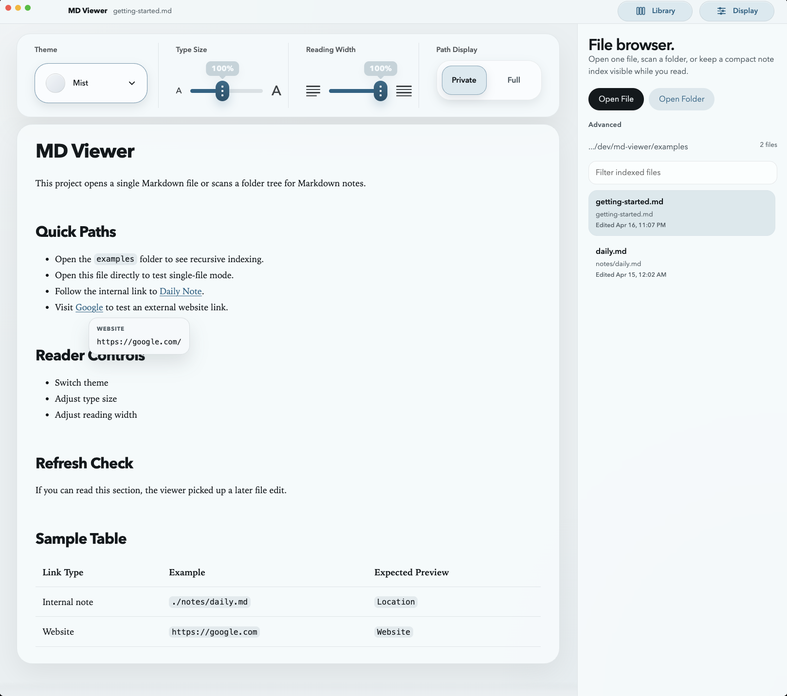

# MD Viewer

A lightweight Electron app for reading Markdown files with a minimal interface.



## Features

- Open a single Markdown file
- Open a folder and recursively scan for Markdown files
- Render local images and internal Markdown links
- Adjust theme, font size, and reading width with persisted local settings

## Getting Started

```bash
npm install
npm start
```

You can also pass a file or folder path on launch:

```bash
npm start -- /absolute/path/to/notes
```

Or launch the included sample set:

```bash
npm start -- ./examples
```

For the large-document navigation example specifically:

```bash
npm start -- ./examples/large-doc.md
```

## Build Installable Apps

The project now includes `electron-builder`, so you can package a real app instead of launching it through `npm start`.

Install dependencies:

```bash
npm install
```

Build an unpacked app bundle for a quick local smoke test on your current platform:

```bash
npm run build
```

Create a macOS app bundle and DMG from macOS:

```bash
npm run dist:mac
```

The output is written to `dist/`. On macOS, the main artifacts will be:

- `dist/mac-arm64/MD Viewer.app` on Apple Silicon Macs
- `dist/MD Viewer-<version>.dmg`

Create a Windows installer from Windows:

```bash
npm run dist:win
```

The main Windows artifact will be an NSIS installer in `dist/`, typically:

- `dist/MD Viewer Setup <version>.exe`

### Important Platform Note

Electron packaging is most reliable when you build on the target operating system:

- Build macOS binaries on macOS
- Build Windows binaries on Windows

If you want both automatically, use CI to build each platform on its own runner. A sample GitHub Actions workflow is included in `.github/workflows/build.yml`.

### Run the Packaged App

After building:

- On macOS, open the generated `.app` inside the platform folder under `dist/` such as `dist/mac-arm64/MD Viewer.app`, or install from the generated DMG
- On Windows, run the generated `Setup.exe` and launch the installed app normally

Unsigned apps may trigger Gatekeeper or SmartScreen warnings until you add code signing.

## Supported Markdown Extensions

- `.md`
- `.markdown`
- `.mdown`
- `.mkd`
